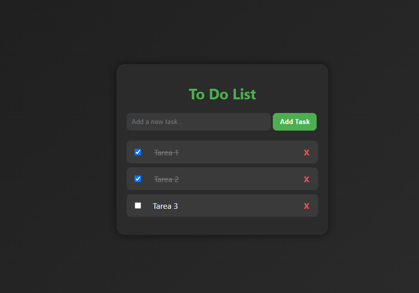

<<<<<<< HEAD
# 📝 To-Do List

Aplicación web de lista de tareas desarrollada con **HTML, CSS y JavaScript**.  
Las tareas se almacenan en **LocalStorage**, lo que permite mantenerlas guardadas incluso al cerrar el navegador.

---

## 🚀 Funcionalidades

✅ Agregar nuevas tareas  
✅ Marcar tareas como completadas  
✅ Editar tareas con doble clic  
✅ Eliminar tareas  
✅ Persistencia en `localStorage`  

---

## 🖼️ Vista previa




---

## 🌍 Demo en línea

👉 [Abrir la aplicación](https://Frannkk-1994.github.io/To-Do-List/)


---

## 🛠️ Tecnologías utilizadas

- **HTML5** → estructura de la aplicación  
- **CSS3** → diseño responsivo y animaciones  
- **JavaScript (ES6)** → lógica e interacción  
- **LocalStorage** → persistencia de datos en el navegador  

---

## 📦 Instalación y uso

1. Clonar el repositorio:
   ```bash
   git clone https://github.com/Frannkk-1994/To-Do-List.git
=======
# To-Do-List
Aplicación To-Do List en HTML, CSS y JavaScript con guardado en localStorage.
>>>>>>> ca97b2843a10a238ce5bc9599969f689d5587a88
